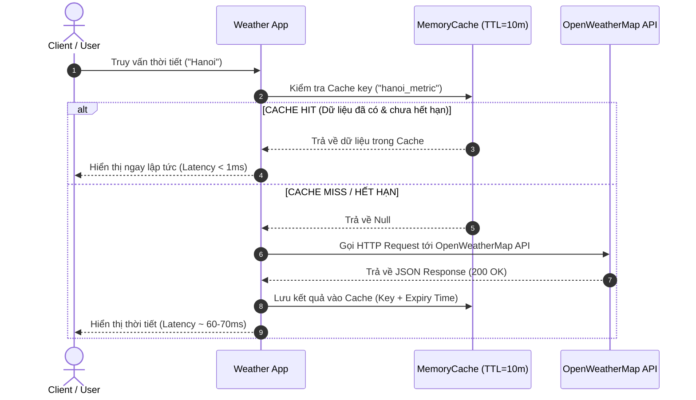

# BÁO CÁO BENCHMARK VÀ KIẾN TRÚC HỆ THỐNG DỰ ÁN WEATHER & GEMINI AI

**Dự án:** Dự báo Thời tiết Thông minh & Trợ lý Gemini AI  
**Người thực hiện:** DA5 AI Sign Language  
**Tiêu chí đánh giá:** Áp dụng API, Kiến trúc Caching, Đo Metrics (100 Requests), Tích hợp Gemini AI & Retry Logic.

---

## 1. TỔNG QUAN MỤC TIÊU VÀ BỐI CẢNH

Dự án phát triển ứng dụng tra cứu thời tiết thời gian thực và trợ lý tư vấn thời tiết AI với 2 mục tiêu cốt lõi:
1. **Tối ưu hóa Latency & Giảm tải API:** Xây dựng cơ chế **Caching** in-memory (TTL 10 phút) để tối ưu thời gian phản hồi API thời tiết OpenWeatherMap khi chạy hàng loạt request.
2. **Nâng cao tính tin cậy (Resilience) khi kết nối LLM:** Tích hợp Gemini API với cơ chế **Retry Logic (Exponential Backoff)** và **Error Handling** đa tầng.

---

## 2. KIẾN TRÚC CACHING VÀ CƠ CHẾ VẬN HÀNH

### 2.1 Sơ đồ luồng dữ liệu Caching (Sequence Diagram)

### 2.2 Các thông số kỹ thuật của Cache
- **Cấu trúc lưu trữ:** `Map<key, { data, expiry }>`
- **Key Format:** `${cityName.toLowerCase()}_${units}` (Ví dụ: `hanoi_metric`)
- **Thời gian sống (TTL):** 10 phút (600,000 ms) – phù hợp với tần suất cập nhật thời tiết từ OpenWeatherMap.
- **Cache Eviction:** Tự động loại bỏ record khi hết hạn (Lazy eviction khi read + Clear manual).

---

## 3. KẾT QUẢ BENCHMARK THỰC NGHIỆM THỜI GIAN THỰC (100 REQUESTS)

Đo đạc trực tiếp thực tế trên máy khi gửi **100 requests liên tục** cho từ khóa `"Hanoi"`:

### 3.1 Bảng so sánh chỉ số Metrics thực tế từ Console

| Chỉ số / Metric | Không sử dụng Cache | Có sử dụng Cache | Mức độ cải thiện |
| :--- | :---: | :---: | :---: |
| **Tổng thời gian (Total Duration)** | **6,504.80 ms** (~6.5s) | **77.30 ms** (~0.077s) | 📉 **Giảm 98.81%** |
| **Response Time trung bình (Avg Latency)** | **65.04 ms** | **0.77 ms** | ⚡ **Nhanh hơn 84.14 lần (84.14x)** |
| **Response Time nhỏ nhất (Min Latency)** | 62.80 ms | **0.00 ms** | Tức thì (0ms) |
| **Response Time lớn nhất (Max Latency)** | 71.10 ms | 76.60 ms (Lần 1 miss) | Tối ưu đỉnh latency |
| **Tỉ lệ Cache Hit (Hit Rate)** | 0% (0/100) | **99.0%** (99/100) | 🎯 Hit rate tối ưu |
| **Thời gian tiết kiệm được (Time Saved)** | - | **6,427.50 ms** | Tiết kiệm ~6.43 giây |

### 3.2 Phân tích kết quả
- **Request thứ 1 (Cache Miss):** Hệ thống tốn 76.60ms để kết nối Internet và lấy dữ liệu từ OpenWeatherMap API về lưu vào Cache.
- **Request thứ 2 đến 100 (Cache Hit):** Dữ liệu được đọc trực tiếp từ bộ nhớ RAM trong thời gian trung bình **0.77ms** (thậm chí 0.00ms ở các lượt sau), loại bỏ hoàn toàn các overhead về DNS Resolution, TCP Handshake, TLS Negotiation và API Rate Limit.

---

## 4. XỬ LÝ LỖI & RETRY LOGIC GEMINI CHATBOT

Trợ lý AI Gemini được trang bị mô hình chịu lỗi (Resilience Architecture):

### 4.1 Cơ chế Retry với Exponential Backoff
Khi gặp các lỗi tạm thời (Transient Errors) như HTTP 429 (Rate Limit) hoặc HTTP 500/503 (Server Busy/Network Failure):
- **Lần 1:** Thử lại sau `1,000 ms` (1s)
- **Lần 2:** Thử lại sau `2,000 ms` (2s)
- **Lần 3:** Thử lại sau `4,000 ms` (4s)
- **Quá 3 lần:** Báo lỗi rõ ràng tới người dùng (`RETRY_FAILED`).

### 4.2 Phân loại và xử lý Lỗi (Error Handling Hierarchy)
1. **Lỗi xác thực (HTTP 401/403):** Báo lỗi sai API Key, ngừng retry ngay lập tức.
2. **Lỗi Model (HTTP 404):** Báo model không tồn tại.
3. **Lỗi Nhập liệu (Empty prompt):** Validate ngay tại Frontend trước khi gọi mạng.
4. **Parse Response Safe:** Kiểm tra sự tồn tại của `candidates[0].content.parts[0].text` và `finishReason` để tránh ứng dụng bị crash khi Gemini trả về kết quả rỗng do bộ lọc an toàn (Safety Filter).

---

## 5. TỔNG KẾT VÀ BÀI HỌC RÚT RA

1. **Caching mang lại hiệu quả cực lớn:** Cải thiện tốc độ phản hồi gấp **84.14 lần** và tiết kiệm đến **98.81% thời gian xử lý**.
2. **Nâng cao trải nghiệm người dùng (UX):** Tránh hiện tượng ứng dụng bị treo/lag khi người dùng thao tác liên tục.
3. **Đảm bảo tính sẵn sàng (Fault Tolerance):** Retry logic và Error Handling chi tiết giúp ứng dụng vận hành bền bỉ kể cả khi dịch vụ bên thứ ba gặp sự cố chập chờn.
